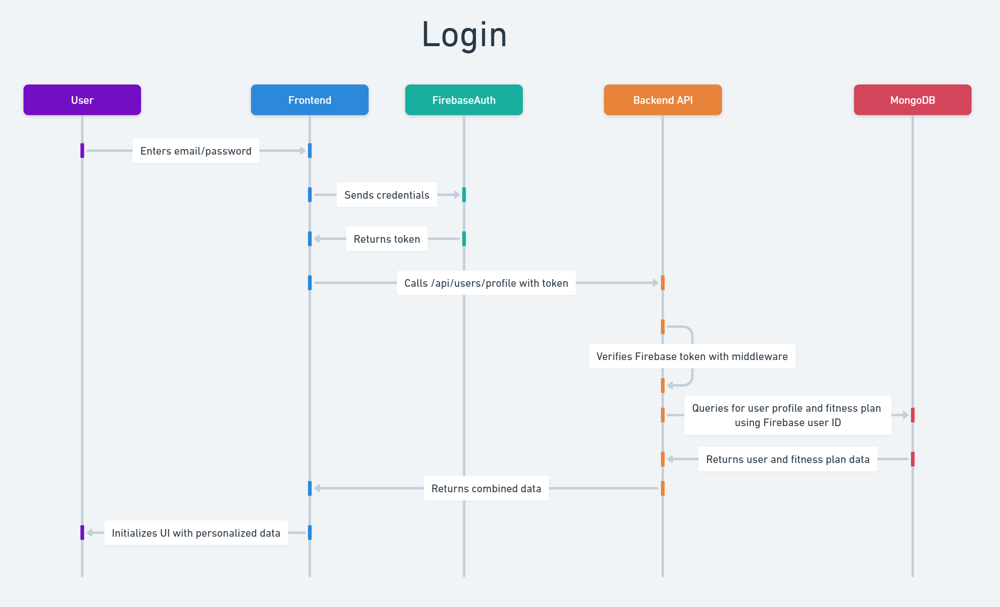

# AI Fitness Coach

## 1. Project Overview / Technical Description

The AI Fitness Coach is a mobile application designed to provide users with personalized fitness and diet plans. Users can sign up, provide their fitness goals and preferences via a survey, and receive a tailored weekly plan generated by an Artificial Intelligence Large Language Model. The application also allows users to track their workout progress and manage their account.

### Key Technologies:

- Frontend: React Native (Mobile Application)
- Backend API: Node.js with Express.js
- Database: MongoDB
- AI Service: Google Gemini API (Large Language Model)

## 2. Architecture Overview

### 2.1. High-Level Architecture Description

The system follows a microservice-oriented architecture with distinct components interacting through APIs.

- **React Native Client**: The user-facing mobile application where users interact with the system. It sends requests to and receives responses from the Backend API.
- **Node.js/Express.js Backend API**: The central hub for business logic, data persistence, and communication with external services. It works with Firebase Authentication for user authentication and authorization, manages data (storing user profiles, fitness plans, and progress), and orchestrates requests to the Gemini API.
- **MongoDB**: The NoSQL document database used for persistent storage of all application data, including user credentials, profiles, generated fitness plans, and workout progress.
- **Gemini API (LLM Service)**: An external AI service responsible for processing user survey data and generating personalized fitness and diet plans.

### 2.2. Technology Stack

- Frontend Framework: React Native
- Backend Runtime: Node.js
- Backend Web Framework: Express.js
- Authentication: Firebase Authentication
- Database System: MongoDB
- AI Model: Google Gemini API
- Communication Protocol: HTTP/HTTPS (RESTful APIs)
- Data Format: JSON

## 3. Database Schema

### 3.1. `users` Collection Schema

This collection stores core user information, including authentication details and survey responses.

```javascript
// users collection
{
  "_id": "<ObjectId>", // MongoDB document ID
  "firebaseUserId": "<String>", // Unique identifier for the user from Firebase Auth
  "userInfo": {      // Stores user information.
    "firstName": "<String>",
    "lastName": "<String>",
    "email": "<String>" // Should match the email used in Firebase Auth
  },
  "profile": {          // Stores user's personal and preference data from the survey.
    "fitnessGoals": ["<String>"], // Array of fitness goals e.g. ["Build muscle", "Lose weight"]
    "currentWeight": "<String>", // Current weight in pounds as a string
    "desiredWeight": "<String>", // Desired weight in pounds as a string
    "height": "<String>", // Height in inches as a string
    "fitnessLevel": "<String>", // e.g. "Beginner", "Intermediate", "Advanced"
    "ageGroup": "<String>", // e.g. "18-24", "25-34", "35-44"
    "workoutDaysPerWeek": "<Number>", // Number of days per week user can work out
    "preferredWorkoutTime": "<String>", // e.g. "Morning", "Midday", "Evening"
    "availableEquipment": ["<String>"], // Array of available equipment
    "dietaryPreferences": ["<String>"], // Array of dietary preferences
    "dietaryRestrictions": ["<String>"], // Array of dietary restrictions
    "otherRestrictions": "<String>", // Any other restrictions as free text
    "healthConsiderations": "<String>", // Any health considerations as free text
    "enjoyedWorkouts": ["<String>"], // Array of workout types the user enjoys
    "workoutsToAvoid": ["<String>"] // Array of workout types to avoid
  },
  "progress": {          // Stores user's progress tracking data
    "weightHistory": [   // Array of weight entries
      {
        "_id": "<ObjectId>", // Unique identifier for this entry
        "date": "<Date>",    // Date when weight was recorded
        "weight": "<Number>" // Weight value in user's preferred unit
      }
    ],
    "workoutHistory": [  // Array of workout completion records
      {
        "_id": "<ObjectId>", // Unique identifier for this entry
        "date": "<Date>",    // Date when workout was completed
        "workoutId": "<String>", // Optional reference to specific workout in fitness plan
        "notes": "<String>"  // Optional notes about the workout completion
      }
    ]
  },
  "createdAt": "<Date>", // Timestamp for user creation.
  "updatedAt": "<Date>"  // Timestamp for last profile update.
}
```

### 3.2. `fitnessPlans` Collection Schema

This collection stores individual fitness and diet plans generated for users by the AI.

```javascript
// fitnessPlans collection
{
  "_id": "<ObjectId>",      // Unique identifier for this fitness plan document.
  "userId": "<ObjectId>",   // References the user associated with this plan.
  "generatedPlan": {        // The AI-generated workout and diet schedule.
    "weekly_plan": {
      "monday": {
        "workout": {
          "type": "<String>",
          "duration_minutes": "<Number>",
          "exercises": [
            {
              "name": "<String>",
              "sets": "<String>",
              "reps": "<String>",
              "notes": "<String>"
            }
          ],
          "notes": "<String>"
        },
        "diet": {
          "daily_notes": "<String>",
          "estimated_calories": "<Number>",
          "macronutrient_summary": {
            "protein_grams": "<Number>",
            "carbs_grams": "<Number>",
            "fat_grams": "<Number>"
          },
          "meals_list": [
            {
              "meal_type": "<String>",
              "description": "<String>"
            }
          ]
        }
      },
      "tuesday": { /* ... similar structure for other days ... */ },
      "wednesday": { /* ... */ },
      "thursday": { /* ... */ },
      "friday": { /* ... */ },
      "saturday": { /* ... */ },
      "sunday": { /* ... */ }
    },
    "general_notes": "<String>" // Any overall tips or disclaimers for the plan.
  },
  "createdAt": "<Date>",    // Timestamp for when this plan was generated/created.
  "updatedAt": "<Date>"     // Timestamp for last update to the plan or progress.
}
```

## 4. User Interaction Flows

These flows detail the sequence of user actions and system responses.

### 4.1. User Onboarding & Personalized Plan Creation

**Description**: The process from a new user signing up to receiving and confirming their initial personalized fitness and diet plan.


**Steps**:

1.  **User Initiates Onboarding**: The user fills out a survey and provides account details on the React Native front-end.
2.  **Firebase Authentication**: The front-end calls Firebase Auth using email and password to create a new user account and obtains an authentication token.
3.  **Submit User Profile & Survey**: The front-end sends an HTTP POST request to `/api/users/onboarding` with the Firebase token and survey data.
4.  **Process User Onboarding**: The back-end verifies the Firebase token, extracts the userId, and saves the user information and profile data to the `users` collection in MongoDB.
5.  **Generate Personalized Plan**: The back-end calls the Gemini API (via `generateGeminiContent`) with the user's profile data to generate a personalized workout/diet plan as JSON.
6.  **Store & Deliver Plan**: The back-end inserts the JSON plan into the `fitnessPlans` collection and sends a response with both the user object and fitness plan to the front-end.
7.  **Display Plan to User**: The front-end renders the workout and diet plan in a calendar format for the user.
8.  **User Confirms or Regenerates Plan**: The user either confirms the displayed plan or clicks to regenerate a new plan, which directly triggers a re-request to the Gemini API (steps 5-7) using their existing profile.

### 4.2. User Authentication & Session Management

**Description**: Authentication flow for returning users.



**Participants**: Mobile App, Firebase Auth, API Backend, MongoDB

**Login Sequence**:

1.  **Credential Entry**: User enters email/password in mobile app.
2.  **Authentication**: Mobile app sends credentials to Firebase Auth. Firebase validates and returns a token.
3.  **Token Storage**: Mobile app receives the token and stores it.
4.  **User Data Request**: Mobile app calls `/api/users/profile` with token in Authorization header.
5.  **Token Verification**: API backend verifies Firebase token with authMiddleware.
6.  **Data Fetching**: API queries MongoDB for user profile and fitness plan using Firebase user ID.
7.  **Response**: API returns combined user and fitness plan data to mobile app.
8.  **Session Setup**: Mobile app initializes UI with received personalized data.

**Ongoing Authentication**:

1.  **Protected Requests**: Mobile app includes token in all API requests.
2.  **Request Validation**: API verifies token before processing each request.
3.  **Token Management**: Mobile app refreshes token before expiration.
4.  **Logout**: On user logout, mobile app clears token and notifies Firebase.

### 4.3. Track Workout Completion

**Description**: How a user records workout completion and updates their progress.


**Steps**:

1.  **User Records Workout Completion**: The user enters workout completion details in the front-end, including date, optional notes, and workout reference.
2.  **Submit Workout Data**: The front-end sends an HTTP POST request to `/api/progress/workout` with the workout completion data.
3.  **Record Progress**: The back-end adds the workout entry to the `progress.workoutHistory` array within the user's document in MongoDB.
4.  **Confirm Update**: The back-end sends a success response with the created entry to the front-end.
5.  **Display Confirmation**: The front-end visually updates the completed workout and refreshes the workout history display if needed.

**For Updating or Removing Workout Entries**:

1. **Update Workout Entry**: The front-end sends an HTTP PUT request to `/api/progress/workout/:entryId` with updated data.
2. **Delete Workout Entry**: The front-end sends an HTTP DELETE request to `/api/progress/workout/:entryId` to remove an entry.

### 4.4. Progress Tracking

**Description**: How users track their weight history and view their progress over time.

**Steps**:

1. **User Records Weight**: The user enters a new weight measurement in the front-end.
2. **Submit Weight Data**: The front-end sends an HTTP request to `/api/progress/weight` with the weight and date information.
3. **Store Progress**: The back-end adds the entry to the `progress.weightHistory` array within the user's document in MongoDB.
4. **Confirm Update**: The back-end sends a success response with the created entry to the front-end.
5. **Display Progress**: The front-end updates to show the new entry and refreshes any progress charts or statistics.

**For Progress History Retrieval**:

1. **User Views Progress History**: The user navigates to the progress section in the front-end.
2. **Request History Data**: The front-end sends HTTP requests to `/api/progress/workout-history` and `/api/progress/weight-history`.
3. **Retrieve History**: The back-end queries the user document and extracts the requested history arrays.
4. **Display History**: The front-end renders the history data as charts or lists for the user to track their progress over time.

### 4.5. User Account Deletion

**Description**: The process of a user permanently deleting their account and associated data.


**Steps**:

1.  **User Initiates Deletion**: The user confirms account deletion on the profile page.
2.  **Request Account Deletion**: The front-end sends an HTTP request to the back-end to delete the account.
3.  **Process Account Deletion**: The back-end deletes the user's data from both the `users` and `fitnessPlans` collections in MongoDB.
4.  **Confirm Deletion**: The back-end sends a success response to the front-end.
5.  **User Notification & Logout**: The user is logged out, and a confirmation message is displayed.

## 5. Conclusion

This document provides a foundational technical design for the AI Fitness Coach application, outlining its architecture, database schemas, and core user interaction flows. This will serve as a valuable reference for the development team in implementing the system.
